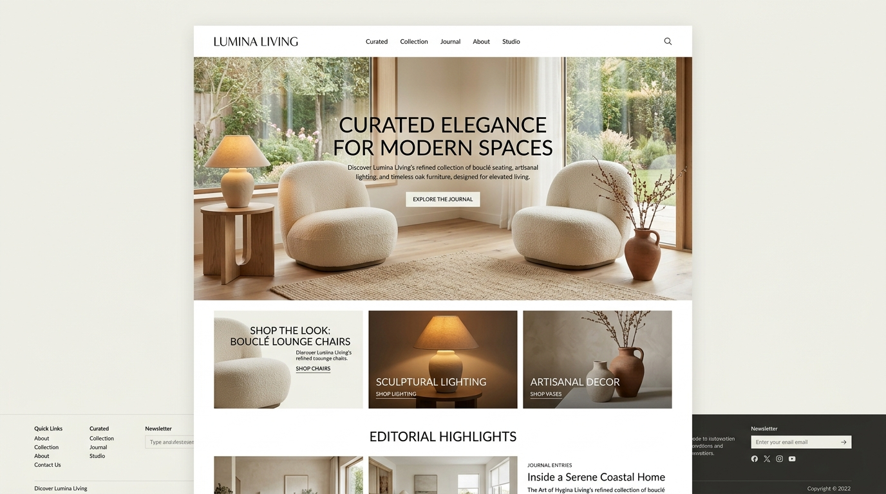

# Lumina Living — Curated Home Decor & Artisanal Furniture


An editorial luxury home decor and artisanal furniture e-commerce experience built with **Vanilla HTML5/CSS3/JavaScript** frontend and a lightweight **Python 3** REST API backend.



---

## 🌟 Key Features

- 🛋️ **Curated Room Collections**: Browse sculptural lamps, bouclé lounge chairs, white oak coffee tables, and handcrafted ceramic vases.
- 🔍 **Live Search & Filter Tabs**: Filter items instantly by category (`lighting`, `seating`, `tables`, `decor`, `bedroom`) and keyword search.
- ↕️ **Custom Sorting**: Sort objects by ascending/descending price, customer reviews, or title.
- 🏺 **Artisan Object Detail View**: View material composition, dimensions, care instructions, and origin details.
- 🛍️ **Interactive Sliding Shopping Bag**:
  - Live quantity adjustment and subtotal calculations.
  - Persistent storage using `localStorage`.
  - Complimentary White Glove Delivery threshold indicator.
- 🎟️ **Privilege Promo Codes**: Real-time voucher discounts (Try `LUMINA15` for 15% off, `HOMELUXE20` for 20% off).
- 💳 **Atelier Checkout & Order Processing**:
  - Full client and delivery destination form validation.
  - Simulated payment processing.
  - Automatic inventory deduction upon order submission.
- 🧾 **Printable Invoice & Tracking**:
  - Printable receipt layout with dedicated print styles.
  - Order lookup and live status tracker (`LUM-XXXXX`).

---

## 🛠️ Technology Stack

- **Frontend**: HTML5, Vanilla CSS3 (Warm Editorial Luxury Aesthetic, Cormorant Garamond typography), Modern JavaScript.
- **Backend**: Python 3 (Native HTTP REST Server, no complex external dependencies).
- **Database**: Persistent JSON storage (`data/products.json` & `data/orders.json`).

---

## 🚀 Getting Started

### 1. Prerequisites
- [Python 3.8+](https://www.python.org/)

### 2. Run the Application
Clone the repository and run the server:
```bash
git clone https://github.com/hussainvalidudekula447-bit/lumina-living-ecommerce.git
cd lumina-living-ecommerce
python server.py
```

Open your browser and navigate to:
```
http://localhost:5000
```

---

## 📡 REST API Endpoints

| Method | Endpoint | Description |
| :--- | :--- | :--- |
| `GET` | `/api/products` | Get all products (supports `?category=`, `?search=`, `?sort=`) |
| `GET` | `/api/products/<id>` | Get details for a specific object |
| `GET` | `/api/categories` | Get category list and counts |
| `POST` | `/api/promo/validate` | Validate privilege discount vouchers |
| `POST` | `/api/orders` | Process and save an atelier order |
| `GET` | `/api/orders` | Get recent orders |
| `GET` | `/api/orders/<id>` | Look up order status by reference ID |

---

## 🎟️ Demo Promo Codes
- `LUMINA15` &rarr; 15% Off Lumina Living Collection
- `HOMELUXE20` &rarr; 20% Off Luxury Furniture & Decor
- `WELCOME10` &rarr; 10% Welcome Gift

---

## 👨‍💻 Author
- GitHub: [@hussainvalidudekula447-bit](https://github.com/hussainvalidudekula447-bit)

---

## 📄 License
This project is open-source and available under the [MIT License](LICENSE).
